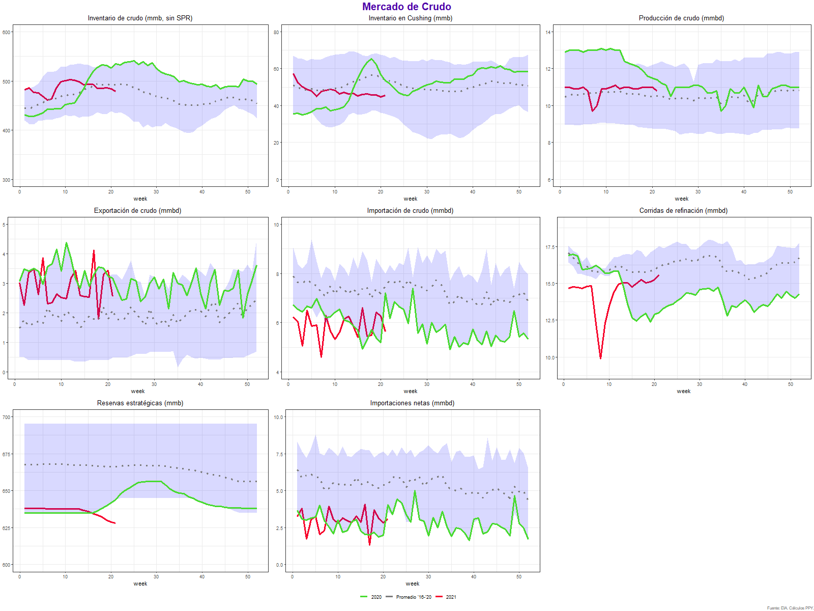

# EIA-Inventories-graphics
Code to create graphics on demand, supply and inventories of crude and productos bases on weekly EIA. 

Read EIA API documentation on: https://www.eia.gov/opendata/

Charts:

* Crude inventories
* Cushing inventories
* Oil production
* Crude exports
* Crude imports
* Refinery runs
* SPR
* Crude net imports
* Products inventories
* Gasoline inventories
* Distillate inventories
* Products supplied (implicit demand)
* Gasoline supplied (implicit demand)
* Distillates supplied (implicit demand)
* Gasoline and distillates yield
* Gasoline exports
* Resids inventories
* Jet Inventories
* Propane inventories
* Resids supplied
* Jet supplied
* Jet demand
* Propane demand
* Jet yield
* Asphalt Inventories 

